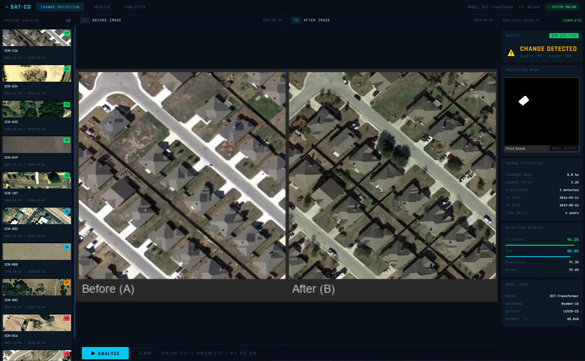
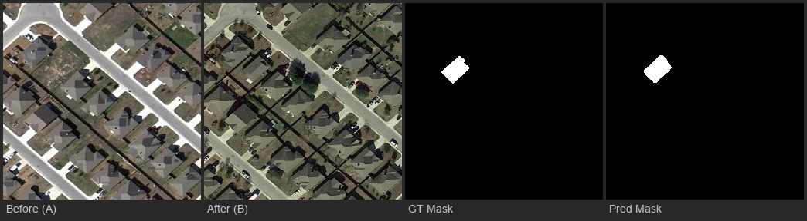
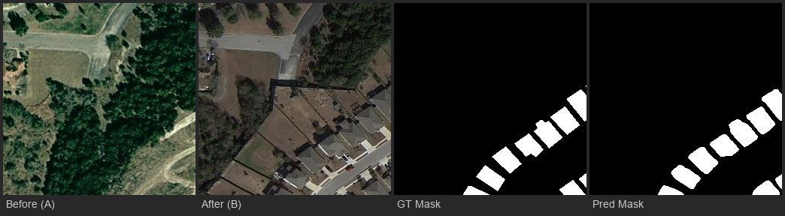
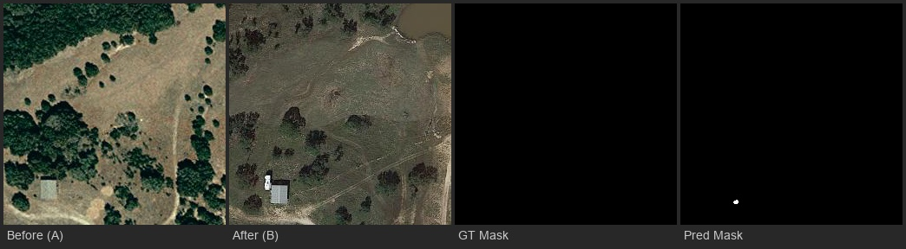
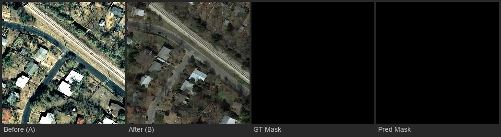
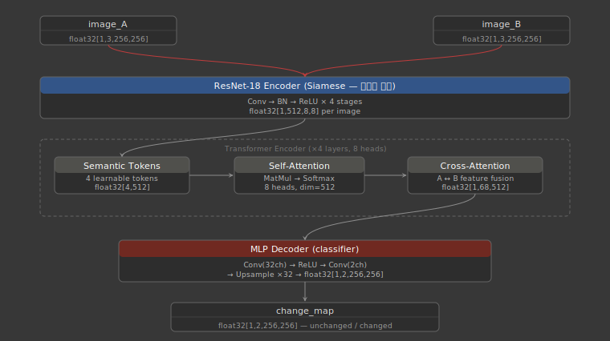
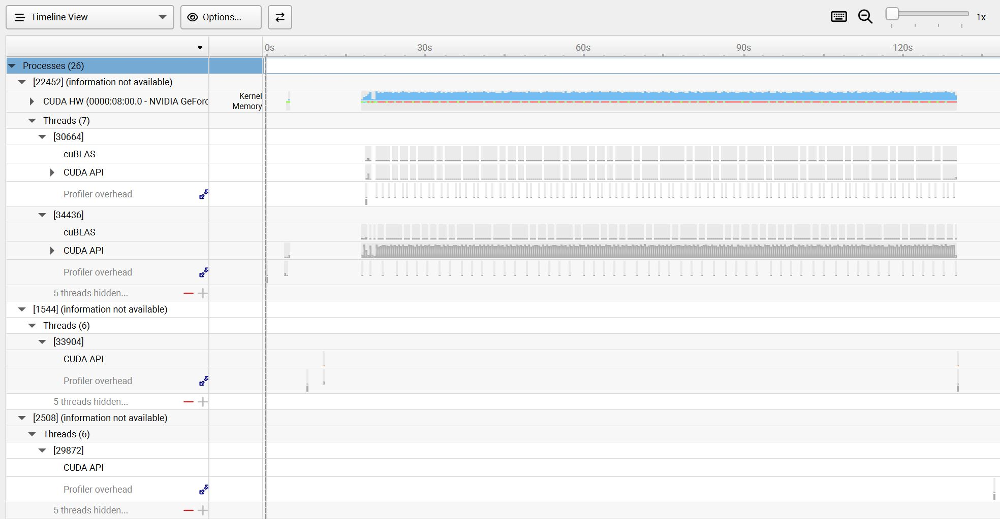

# 🛰️ Satellite Building Change Detection
### LEVIR-CD | ChangeFormer & BIT 비교 실험 포트폴리오


[](https://Eric-lawlight.github.io/satellite-change-detection/demo/demo.html)

---

## 📌 프로젝트 개요

위성 영상 기반 건물 변화 감지(Change Detection) 모델을 구현하고 논문 수준의 성능을 재현하는 프로젝트입니다.

인공위성 관련 기업 Vision AI 엔지니어 지원자격의 **"변화 감지(Change Detection) 모델 설계 및 최적화"** 요구사항에 맞춰,
LEVIR-CD 데이터셋으로 BIT(Binary change detection with Image Transformer) 모델을 학습하고 **F1 88.84%** 를 달성했습니다.

👉 [**인터랙티브 데모 보기**](https://eric-lawlight.github.io/satellite-change-detection/demo/demo.html)



---

## 🖼️ 결과 시각화

각 행은 **Before(A) / After(B) / GT Mask / Pred Mask** 순서입니다.

### ✅ Case 1 — 단일 건물 신축 정확 감지 (True Positive)

> 건물 1동 신축을 GT와 거의 동일하게 예측. 모델의 정밀한 감지 능력을 보여줍니다.

### ✅ Case 2 — 대규모 건물 신축 단지 감지

> 여러 건물이 동시에 신축된 대규모 변화 구역을 정확히 감지.

### ⚠️ Case 3 — False Positive (미세 오탐)

> GT에는 변화가 없지만 모델이 아주 작은 영역을 변화로 예측. 클래스 불균형에 의한 FP 케이스.

### ✅ Case 4 — 변화 없음 정확 판별 (True Negative)

> 변화가 없는 구역을 정확히 변화 없음으로 예측. unchanged 클래스 정확도 99.86% 반영.

---

## 📊 최종 실험 결과

### BIT_CD 성능 (LEVIR-CD Test Set)

| 구분 | F1 | IoU | Precision | Recall | Overall Acc |
|------|-----|-----|-----------|--------|-------------|
| **직접 학습 (200 epoch)** | **88.84%** | **79.92%** | 89.35% | 88.34% | 98.87% |
| 논문 저자 체크포인트 | 89.94% | 81.72% | 90.33% | 89.56% | 98.98% |
| 논문 기준 (BIT) | 90.5% | - | - | - | - |
| BIT + AMP (batch=32) | 82.16% | 69.72% | 90.45% | 75.26% | 98.34% |

### 프레임워크 비교 실험

| 모델 | Framework | changed F1 | 비고 |
|------|-----------|-----------|------|
| ChangeFormer-B1 | Open-CD | 10.47% | ❌ ignore_index 버그 |
| ChangeFormer-B2 | Open-CD | 16.38% | ❌ ignore_index 버그 |
| **BIT (직접 학습)** | **BIT_CD** | **88.84%** | ✅ 목표 달성 |
| BIT (저자 체크포인트) | BIT_CD | 89.94% | ✅ 논문 재현 |
| BIT + AMP (batch=32) | BIT_CD | 82.16% | ⚠️ 과적합 |

---

## 🔍 핵심 트러블슈팅 — ignore_index=255 버그 발견

### 문제 상황
Open-CD + ChangeFormer로 40,000 iter 학습 후 changed F1이 9~10%에 머무름.

### 원인 분석
LEVIR-CD 레이블 체계와 mmsegmentation 기본값의 충돌을 발견했습니다.

```
LEVIR-CD 레이블:  0 = unchanged, 255 = changed
mmseg 기본값:     ignore_index = 255  ← changed 픽셀을 전부 학습에서 제외!
```

`mmseg/models/decode_heads/decode_head.py`의 `BaseDecodeHead.__init__`에서
`ignore_index=255`가 하드코딩되어 있어, 레이블의 255(=changed) 픽셀이
Loss 계산에서 완전히 무시되고 있었습니다.

### 증거
```
Precision: 85%  ← 모델이 changed를 찾는 능력은 있음
Recall:     5%  ← 하지만 거의 예측 안 함 (학습이 안 된 것)
```

### 해결
Open-CD 대신 순수 PyTorch 기반의 BIT_CD로 프레임워크 전환.
BIT_CD는 레이블을 직접 처리하므로 ignore_index 충돌 없음.

---

## 🏗️ 모델 구조 — BIT (Binary change detection with Image Transformer)



- **Backbone**: ResNet-18 (ImageNet pretrained, Siamese — 가중치 공유)
- **Neck**: Transformer 8 layers (Self-Attention → Cross-Attention → FFN)
- **Head**: MLP Decoder — Conv(32ch) → ReLU → Conv(2ch) → Upsample
- **Loss**: Binary Cross Entropy
- **입력**: 256×256 RGB 이미지 쌍 (Before / After)
- **출력**: 256×256 변화 감지 마스크 (2클래스: unchanged / changed)

---

## 📈 학습 곡선

| Epoch | Val mF1 |
|-------|---------|
| 0 | 48.9% |
| 1 | 60.2% |
| 2 | 80.3% |
| 10 | 89.98% |
| **179** | **94.33% (최고점)** |
| 199 | 94.14% |

총 학습 시간: 약 10시간 (RTX 2070 Super, Windows 10)

---

## ⚡ 학습 최적화 실험 — AMP (Automatic Mixed Precision)

### Baseline vs FP16 비교

| 설정 | 처리속도 | 에포크당 배치 | 학습시간 |
|------|---------|------------|---------|
| FP32, batch=16 | 600 img/s | 445 | ~10시간 |
| **FP16, batch=32** | **1,750 img/s** | **223** | **~7시간** |
| 개선율 | **+192%** | 절반 | **-30%** |

PyTorch AMP(`autocast` + `GradScaler`) 적용으로 동일 하드웨어에서 처리량 약 3배 향상.
CUDA 이용률은 두 설정 모두 90%로 동일 — GPU가 연산을 순식간에 끝내는 경량 모델 특성상
이용률 % 수치보다 **imps(초당 처리량)** 가 실질적인 효율 지표임을 확인.
단 batch size 증가로 일반화 성능 저하, 기존 batch=16이 최적 구성 확인.

---

## 🔬 프로파일링 분석

### py-spy — Python 레벨 병목 분석

| 함수 | 비율 | 의미 |
|------|------|------|
| `scaler.step` (optimizer) | 51.8% | AMP 옵티마이저 스텝 |
| `_backward_G` (역전파) | 31.7% | Loss 역전파 |
| `_forward_pass` (순전파) | 12.3% | 모델 추론 |
| DataLoader | ~0% | **병목 없음** ✅ |

→ 학습 시간의 83%가 GPU 연산, DataLoader 병목 없음 확인.  
→ 추가 최적화는 모델 경량화 또는 하드웨어 업그레이드가 유효.

### NVIDIA Nsight Systems — GPU 커널 레벨 분석



| 관찰 항목 | 결과 |
|----------|------|
| CUDA HW 점유율 | 학습 구간 거의 풀가동 ✅ |
| cuBLAS 패턴 | 규칙적 반복 (Transformer attention 정상) |
| GPU 유휴 구간 | validation 전환 시점에만 발생 |
| DataLoader 워커 | num_workers=4 정상 동작 확인 |

→ py-spy + Nsight 두 도구로 병목이 DataLoader가 아닌 GPU 연산 자체임을 정량적으로 검증.  
→ AMP + batch=32 + num_workers=4 설정이 해당 하드웨어에서 최적 구성임을 확인.

---

## 🚀 실행 방법

### 환경 설치
```bash
git clone https://github.com/justchenhao/BIT_CD.git
cd BIT_CD
conda create -n bitcd python=3.9 -y
conda activate bitcd
pip install torch==2.1.0 torchvision==0.16.0 --index-url https://download.pytorch.org/whl/cu121
pip install einops timm
```

### 데이터 준비
```bash
# LEVIR-CD 원본(1024×1024) → 256×256 패치로 변환
python tools/crop_dataset.py
python tools/make_list.py
```

### 학습
```bash
python main_cd.py ^
    --data_name LEVIR ^
    --dataset CDDataset ^
    --checkpoint_root checkpoints ^
    --project_name BIT_LEVIR_scratch ^
    --net_G base_transformer_pos_s4_dd8_dedim8 ^
    --batch_size 16 ^
    --num_workers 2 ^
    --max_epochs 200 ^
    --lr 0.01
```

### 평가
```bash
python main_cd.py ^
    --data_name LEVIR ^
    --dataset CDDataset ^
    --checkpoint_root checkpoints ^
    --project_name BIT_LEVIR ^
    --net_G base_transformer_pos_s4_dd8_dedim8 ^
    --batch_size 8 ^
    --num_workers 0
```

---

## 📁 프로젝트 구조

```
satellite-change-detection/
├── README.md
├── configs/
│   ├── changeformer_mit-b1.py       # 실험1 config
│   ├── changeformer_mit-b2.py       # 실험2 config
│   └── bit_levir.json               # BIT-CD 학습 config
├── tools/
│   ├── crop_dataset.py              # 1024→256 패치 변환
│   ├── make_list.py                 # 학습/검증/테스트 목록 생성
│   ├── fix_labels.py                # 레이블 전처리 (0/255→0/1)
│   └── visualize_results.py         # 결과 시각화
├── docs/
│   ├── BIT_model_architecture.svg   # 모델 구조 다이어그램
│   └── nsight_profile.jpg           # Nsight Systems 프로파일링 결과
└── results/
    └── visualizations/              # Before/After/Mask 이미지

```

---

## 💡 배운 것들

**기술적 인사이트**
- Change Detection에서 레이블 체계와 Loss의 ignore_index 일치가 핵심
- 클래스 불균형(changed ~5%)은 Precision은 높고 Recall이 낮은 패턴으로 나타남
- 프레임워크 의존성이 깊을수록 OS/환경 호환성 문제가 복잡해짐

**엔지니어링 경험**
- 학습 결과를 모니터링 하며 소스코드 디버깅
- 스모크 테스트(500 iter)로 빠르게 검증 후 풀 학습하는 워크플로우
- 프레임워크 전환 결정 기준 (의존성, OS 호환성, 성능)

---

## 📚 참고 논문 및 레포

- [BIT: Remote Sensing Image Change Detection with Transformers](https://arxiv.org/abs/2103.00208) (IEEE TGRS 2021)
- [ChangeFormer: A Transformer-Based Siamese Network for Change Detection](https://arxiv.org/abs/2201.01293) (IGARSS 2022)
- [LEVIR-CD Dataset](https://justchenhao.github.io/LEVIR/)
- [BIT_CD Official Repo](https://github.com/justchenhao/BIT_CD)
- [Open-CD](https://github.com/likyoo/open-cd)

---

## 👤 About

Satellite Vision AI 엔지니어 포지션 지원을 위한 포트폴리오 프로젝트입니다.
